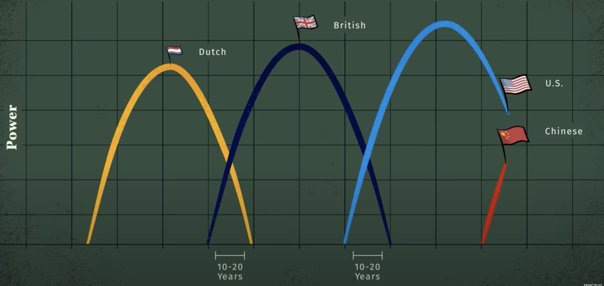

# 原视频地址

[Principles for Dealing with the Changing World Order by Ray Dalio](https://www.youtube.com/watch?v=xguam0TKMw8)

应该是Ray Dalio新书的一个概括

准备把 Principle 看完之后再仔细看看这本

# 原则1：央行印钱，速买黄金

也不一定是黄金，也可以是股票，大宗商品等等能保值的东西

因为马上钱就会贬值

（其实很浅显一道理）

# 原则2：以史为镜，可以知兴替

## Changing Orders

1. 即便利率(interest rate)下降到0，国家都没有足够的钱去还债的时候，央行开始大量印钞。
2. 财富分化会导致穷人和富人之间**内部矛盾**升级，最终演变成左派（要求资产再分配）和右派（认为富人合理持有自己财富）的斗争。
3. 蒸蒸日上的经济体(Rising Great Power)和老大(Leading Great Power)之间的外部矛盾扩大。比如当今的美帝和中国。

=> 国内秩序(Domestic Order)和世界秩序(World Order)都将发生改变

# The Big Cycle

上面这张图展示的是一个世界霸权的形成过程

1. 在一场很大的冲突后，世界形成新的秩序(Order)，某国成为新霸权
2. 因为人们不想去挑战这个霸权，一段平和的繁荣时期形成
3. 人们长期生活在繁荣中，生活越来越好，越来越敢借贷，经济泡沫产生
4. 该国货币作为国际储备货币(**A reserve currency** is a large amount of currency held by central banks and major financial institutions to use for international transactions)，导致更多借贷行为。
5. 同时，这也导致了财富分化越来越严重，穷人莫得钱，富人流油。
6. 经济泡沫破灭，国家印钱
7. 国内矛盾激化，发生革命，国家权力下降
8. 国外新势力崛起，很可能发起战争来挑战霸权
9. 新势力建立起新的秩序，成为新的霸权

循环……

### 霸权图是从下面的国家&强度图总结出来的：

把上面的图稍微平滑一下就是这个↓，也就是上面的“The Big Cycle”

# The Big Cycle In History

## Big Cycle的三阶段

### The Rise

一个霸权的开启既有内因也有外因，主要来源还是一个强有力的改革派：

1. 他们通过获得更多人的支持获得权力
2. 他们削弱了竞争对手，尽可能减少阻力
3. 他们建立起体系(System)和机构(Institution)，使得国家正常运转
   1. 建立起良好的教育体系
   2. 把原始生产模式变更为寻求创新及创造新的技术
   3. 强军(Military)
   4. 建立借贷、债券、股票投资市场
   5. 资本主义(Capitalist)
4. 他们有很好的领导人以及领导人竞选机制

### The Top

- 霸权国家的人民赚了很多钱，花的越来越多，而且变得不愿意工作
- 其他国家的人copy霸权国家的产品和技术，进一步降低霸权竞争力
- 但人民还是觉得自己的好日子将会持续下去，继续借钱花天酒地，经济泡沫产生
- 贫富分化会越来越大，富人的资源好，孩子的受教育程度也高……
- 霸权为了消除自己的泡沫大量借外债

### The Decline

- 先是缓慢下降，然后快速下降
- 当国家内忧外患，经济不好且换不上债时，经济泡沫破裂
- 国家被迫印钞来抵抗危机，先是少量印，然后大量印
- 国家内部矛盾激化，陷入混乱
- 改革派对资产重新分配（可以是强硬的e.g.共，也可以是柔和的e.g.美）
- 境外势力看到了国内的竞争，开始介入干架